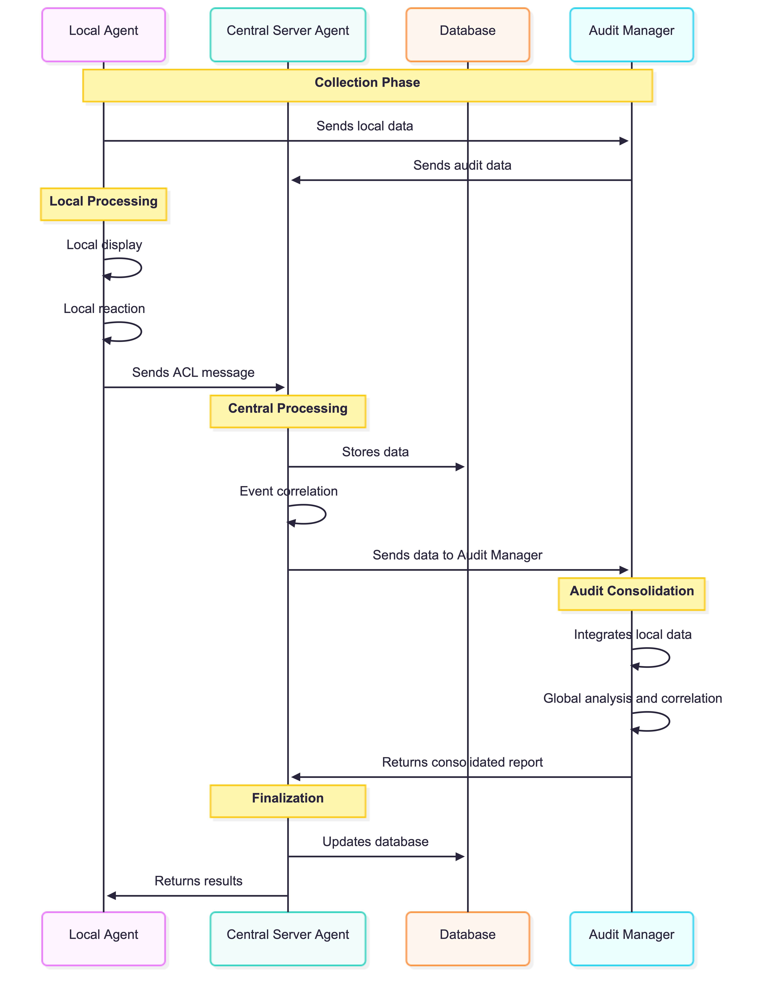

# JADE Agent Deployment and Launch

## Sequence Diagram



## Phase 1: Agent Compilation

Les trois classes d'agents doivent être compilées avec les dépendances JADE et PostgreSQL correctement référencées. La compilation s'effectue via :

```bash
javac -cp /opt/jade/jade/lib/jade.jar:/usr/share/java/postgresql.jar ./myagents/MonitoringAgent.java
javac -cp /opt/jade/jade/lib/jade.jar:/usr/share/java/postgresql.jar ./myagents/CentralAgent.java
javac -cp /opt/jade/jade/lib/jade.jar:/usr/share/java/postgresql.jar ./myagents/AuditAgent.java
```


## Phase 2: Launching the CentralAgent

The CentralAgent must be launched first on the central server (192.168.1.100) so that MonitoringAgents can connect to it. Launch is done with:

```bash
java -cp .:/opt/jade/jade/lib/jade.jar:postgresql-42.7.0.jar jade.Boot -agents "CentralAgent:myagents.CentralAgent"
```


## Phase 3: Deploying MonitoringAgents

On each monitoring machine, a MonitoringAgent is launched with the command:

```bash
java -cp .:/opt/jade/jade/lib/jade.jar:/usr/share/java/postgresql.jar jade.Boot -container -host 192.168.1.100 -agents "agent1:myagents.MonitoringAgent"
```


adding%20a%20new%20template%201.png)

## Phase 4: Verifying Inter-Agent Connectivity

Once all agents are launched, connectivity is verified by observing ACL messages received by th
Une fois tous les agents lancés, la connectivité est vérifiée par l'observation des messages ACL reçus par le CentralAgent.


## Phase 5 : Messages ACL et Transmission de Données

Le CentralAgent reçoit en continu les messages ACL contenant les métriques des MonitoringAgents. Chaque message inclut :
- Identifiant du nœud
- Horodatage précis
- Valeurs CPU, RAM, I/O disque et trafic réseau
- Classification de sévérité

## Phase 5: ACL Messages and Data Transmission

The CentralAgent continuously receives ACL messages containing metrics from MonitoringAgents. Each message includes:
- Node identifier
- Precise timestamp
- CPU, RAM, disk I/O and network traffic values
- Severity classification


## Phase 6: Correlation Activation

Once MonitoringAgents are active and transmitting data, the CentralAgent triggers the correlation module which:
1. Aggregates last 60 seconds of CPU data
2. Calculates correlation coefficients between all nodes
3. Identifies clusters of correlated agents
4. Decides on AuditAgent deployment if necessary


## Communication Architecture

The system uses the ACL (Agent Communication Language) protocol defined by the FIPA standard, ensuring interoperable and standardized communication between JADE agents distributed in the GNS3 infrastructure.
Le système utilise le protocole ACL (Agent Communication Language) défini par la norme FIPA, garantissant une communication interopérable et standardisée entre les agents JADE distribués dans l'infrastructure GNS3.

## Conclusion

Le déploiement des agents JADE sur l'infrastructure GNS3 établit un système multi-agents complètement distribué, autonome et capable de communiquer de manière fiable pour accomplir la surveillance collective du réseau.
